# CryptoTracker
CryptoTracker v 1.2  beta
Built with Ruby 2.7.2  

## Installation

To Install:
```
git clone https://github.com/glenfish/CryptoTracker.git
```

In the 'src' directory, run:  
 ```
 bash crypto.sh
 ```

 Optionally to open directly into a user account, run:  
```
crypto.sh -u "username" -p "password"
```

CryptoTracker uses bundler and the following gems are packaged:  

```
httparty  
json  
terminal-table  
colorize version  
activesupport
```

## Github Repository

[> CryptoTracker App on Github](https://github.com/glenfish/CryptoTracker)


## Statement Of Purpose

CryptoTracker aims to provide investors in cryptocurrency and other digital assets a tool with which to record buys and sells, output profit and loss statements and offer live pricing functionality for the portfolio.

There are online services that offer similar functionality, however most people are not comfortable entering their investments into an unknown website or cloud based service. They prefer anonymity. Many users rely on manually updated Excel spreadsheets.

This app aims to offer a better crypto tracking solution that is local and private, with real time pricing data and other metrics. It was designed to be simple, fast, easy to use and light weight. It requires Ruby and runs on Windows, Mac and Linux systems.

The v1.1 release covered in this README file is a working product that offers many of the features described, however it is a work in progress and may new features will be added over time, beyond the scope of this document. Please check back in the future for updates.


## Scope

A terminal application for creating and managing a portfolio of cryptocurrency or digital assets using live market rate API data.

MVP release of CryptoTracker 

- command line application
- text driven menu
- get live API data (requires API KEY and account with CoinMarketCap.com)
- cache and save price data locally
- read and write local JSON files for long term storage
- admin and user roles
- create regular and admin users (Admin role only)
- activate and deactivate users
- encrypted password storage
- login authentication
- add assets to portfolio
- modify and delete assets in portfolio
- display current portfolio
- Classes for Users and Portfolios
- help file
- bash script to run ruby app
- script flags for auto-login and help
- log out
- 8000+ cryptocurrencies and digital assets

## Additonal planned features post MVP

- add and display 24hr % change, market cap, asset_buy_date, asset_sell_date, usd_profit, btc_profit
- edit all aspects of portfolio
- display summary profit and loss statement
- save portfolio view or P&L to PDF or print
- design and build out a GUI front end
- run as a standalone executable app

## CryptoTracker App Features

### Add Cryptocurrency To Portfolio

The user can add a symbol name that represents the cryptocurrency on trading exchanges, and the quantity purchased. The app will display a list of all entries, showing name, symbol, quantity, current USD price of the asset, and the current USD value of the user's assets, with a grand total showing the combined portfolio value.

This is done by merging hashes and writing to the username.json portfolio file.

### API v Local Calls

To minimise API calls, every call is cached locally in a JSON file. If the portfolio is changed in any way the API is called, otherwise the local cache data is used. Local cache is reset every time a user logs in, resulting in a refresh of pricing. The state management is controlled using an object attribute on the user.

### User Management

An administrator account has user creation privilliges and can activate or deactivate any user. Admin can also view the full list of users, usernames, passwords, status, account type and date the user was created. All users are stored together locally in 'users' JSON file.

## Local Portfolio Files

Each user has their own porfolio JSON file based on their username. The file contains key value pairs for the cryptocurrency symbols (for example 'BTC' for Bitcoin, or 'ETH' for Ethereum) and quantity of assets being tracked in the portfolio for each given user.

## CryptoTracker Screenshots

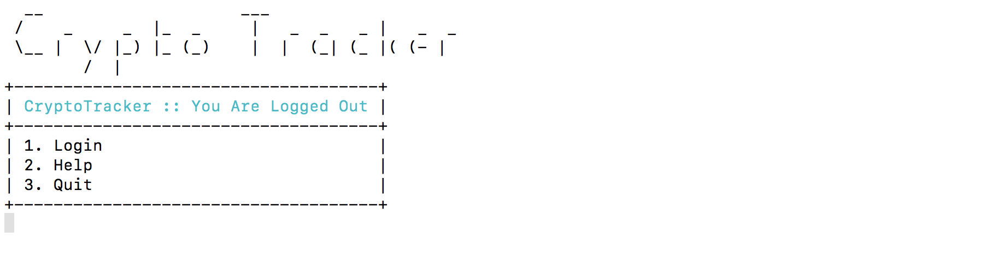
<div style="clear: both;"></div>
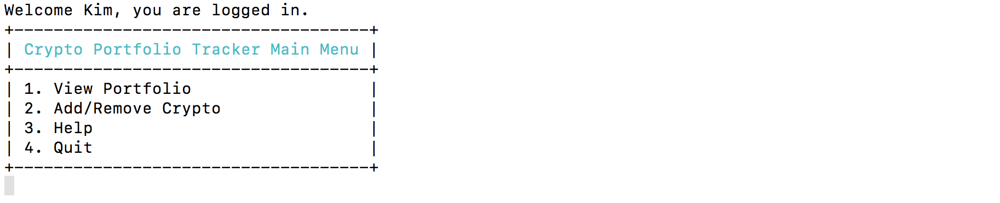
<div style="clear: both;"></div>
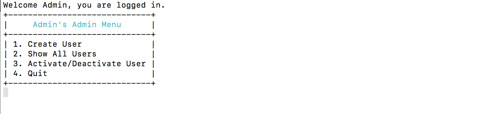
<div style="clear: both;"></div>
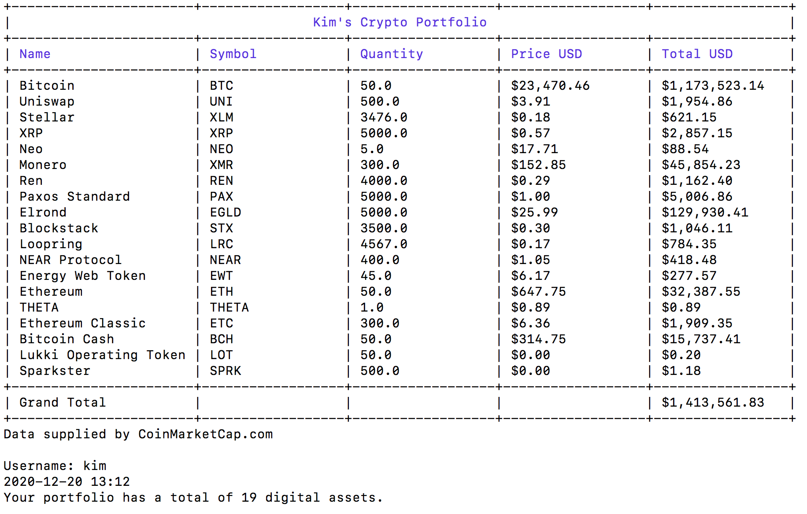
<div style="clear: both;"></div>
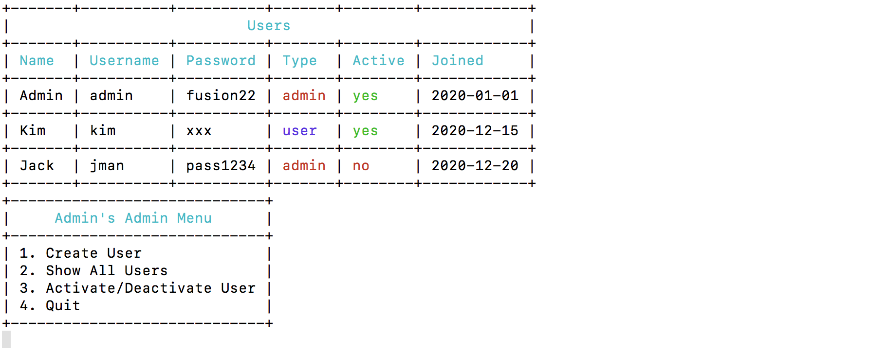
<div style="clear: both;"></div>
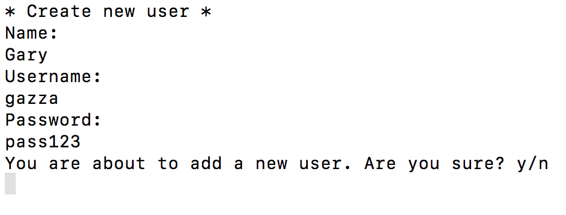
<div style="clear: both;"></div>

# Help

The user can access the following in the help file, listed below:
- Run Instructions
- Using Arguments with the script
- What To Do First
- User options
- Admin options
- Troubleshooting / FAQ

The help file explains in detail how to use the software.

[> View CryptoTracker Help Here](https://github.com/glenfish/CryptoTracker/docs/help_content.txt)

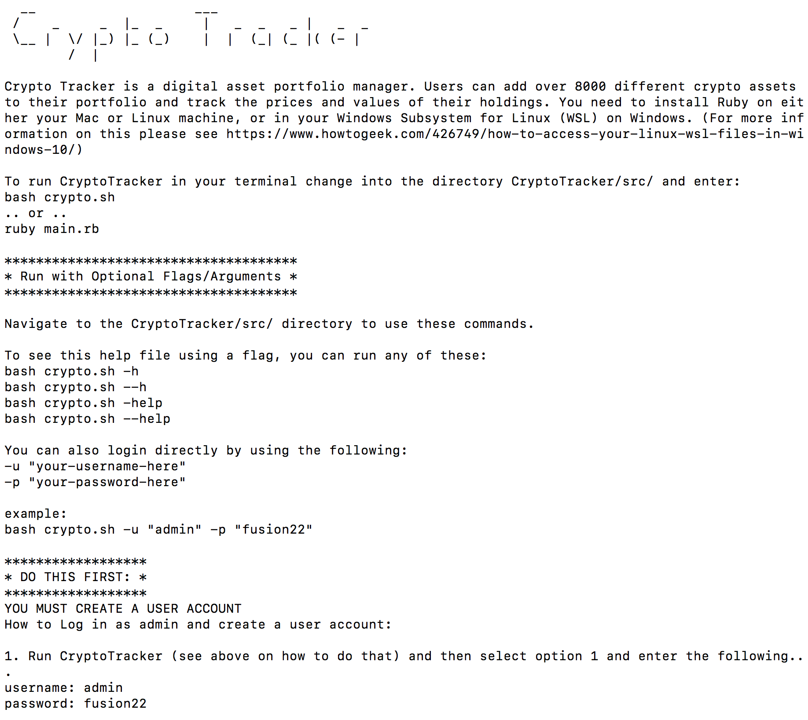
<div style="clear: both;"></div>

## API

The API is using CoinMarketCap.com. 

In testing, the JSON output for the first 100 cryptos on Coin Market Cap was saved to a text file and accessed locally. In v1.1 release, a list of over 8000 cryptos is available to add to the portfolio with pricing data.

Account with CoinMarketCap using the following credentials:  

url: https://pro-api.coinmarketcap.com/v1/cryptocurrency/quotes/latest?symbol=BTC  
account url: https://pro.coinmarketcap.com/account  
data limits: 333 per day. 10k per month

## Data Persistence

User and user's portfolio data is stored locally in JSON file format. A User class instantiates the current user at login and facilitates attribute passing for personalisation of the user experience as well as writing and reading to the correct portfolio file.

Upon user creation, a user is created as an object of the User class, and a portfolio is created as an object of the Portfolio class. The latter uses a method to build the user's portfolio file in JSON format, which is written locally for storage.

At this stage the Portfolio class is only used in this instance, however it will be incorporated more fully with the addition of more app features.

## Error Handling

Errors have been handled with logic in many cases, however where code errors may occur, the flow is not complicated by an over-abundance of error output. Instead, retry and clears have been used to improve the user experience and make it more intuative.

## Control Flow & UML

[> View Control Flow & UML Diagram PDF](https://github.com/glenfish/CryptoTracker/docs/control-flow-uml.pdf)

[> View UML Diagram only](https://github.com/glenfish/CryptoTracker/docs/uml.png)

## Testing

Rspec is initialised in the build, however it is not currently being implemented as part of the testing procedure. It is planned that rspec will become a featured part of further test driven development for CryptoTracker.

Manual testing was completed for all functionality. Some of these tests were documented and screenshots taken.

### Script Login w/ arguments

The admin user's credentials (admin, fusion22) were passed as arguments to the shell script, captured in main.rb and logged the user in automatically.  

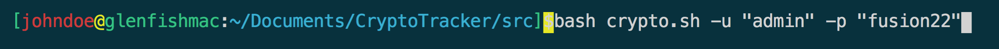
<div style="clear: both;"></div>

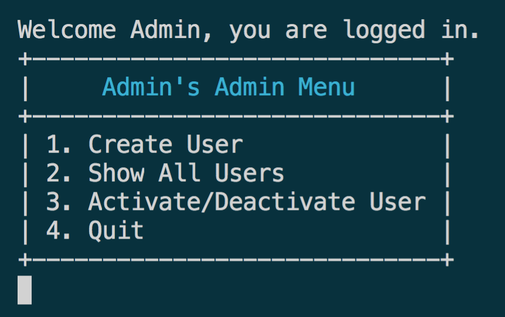
<div style="clear: both;"></div>

### User Login

Login of user was tested using the following credentials:  
username: kim  
password: xxx  

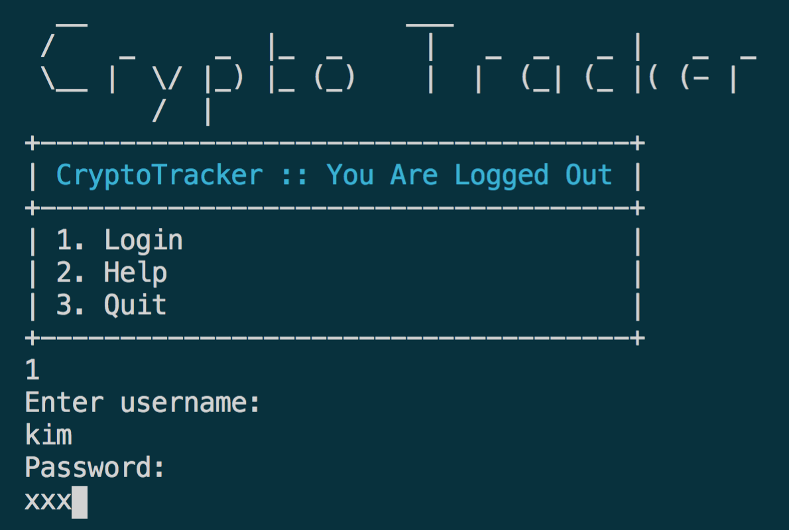
<div style="clear: both;"></div>

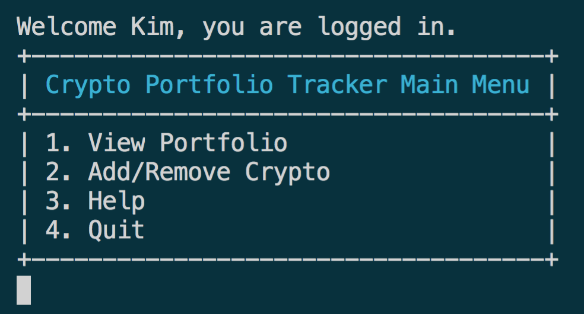
<div style="clear: both;"></div>

### View Portfolio

The 'Kim' user account was used to display the current portfolio. Selecting option 1 called the API and built the portfolio as below:

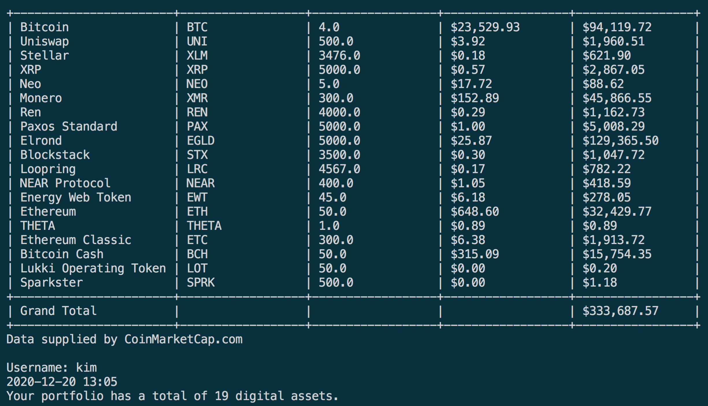
<div style="clear: both;"></div>

### Create User

Admin account successfully created a new admin user account for Jack with username 'jman' and password 'pass1234':

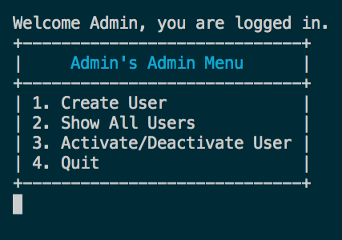
<div style="clear: both;"></div>

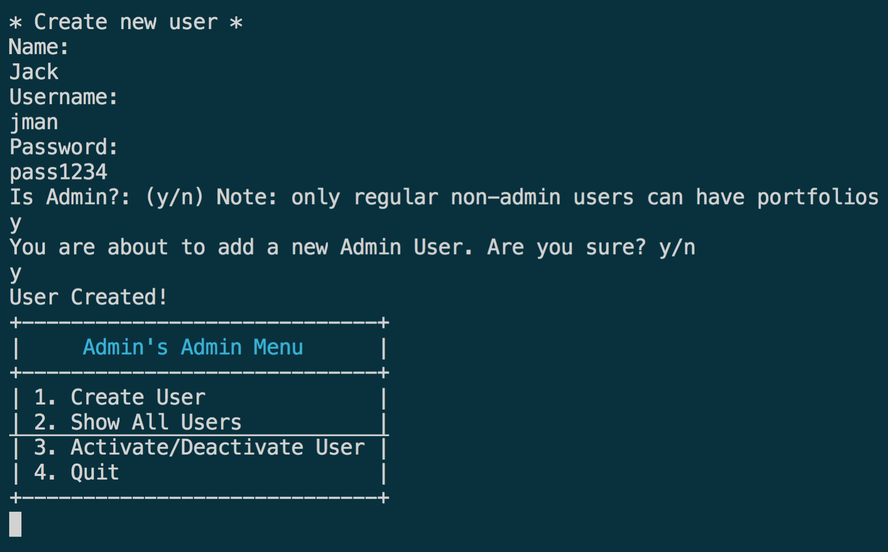
<div style="clear: both;"></div>

The user list displayed shows a new admin user 'Jack' added in the last row:

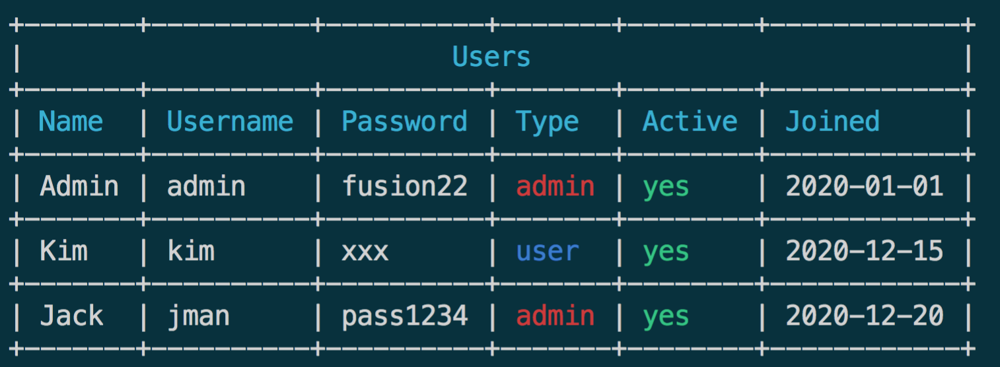
<div style="clear: both;"></div>

Multiple users were created and tested successfully using the following credentials:  

name: Jim  
username: jimbo  
pass: 1234  

name: Scott  
username: djscotty  
pass: 1234  

Name: Gonzo  
username: gonzers  
pass: pass1234  

### Deactivate User

Admin was successful in setting Active to 'no'. In the users.json file this is represented as `"active":false`

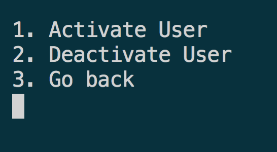
<div style="clear: both;"></div>

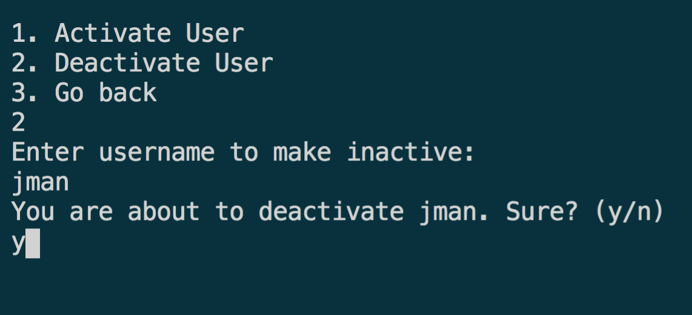
<div style="clear: both;"></div>

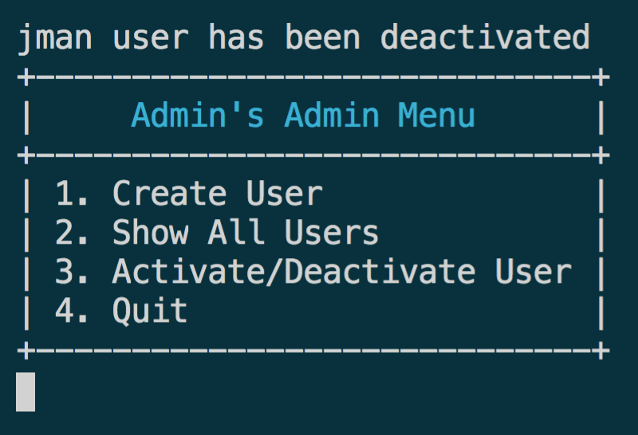
<div style="clear: both;"></div>

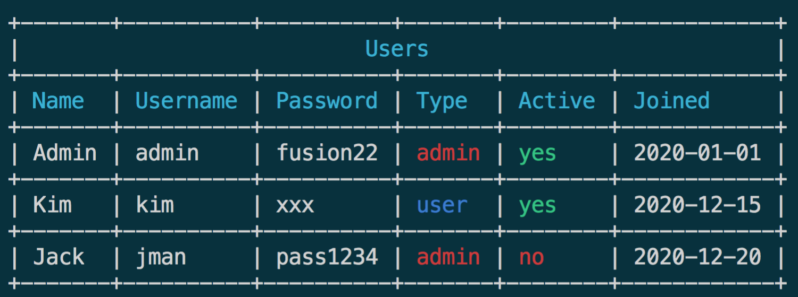
<div style="clear: both;"></div>

### Add/Remove Crypto

Entering a new crypto to the portfolio: symbol BTC , quantity 50.

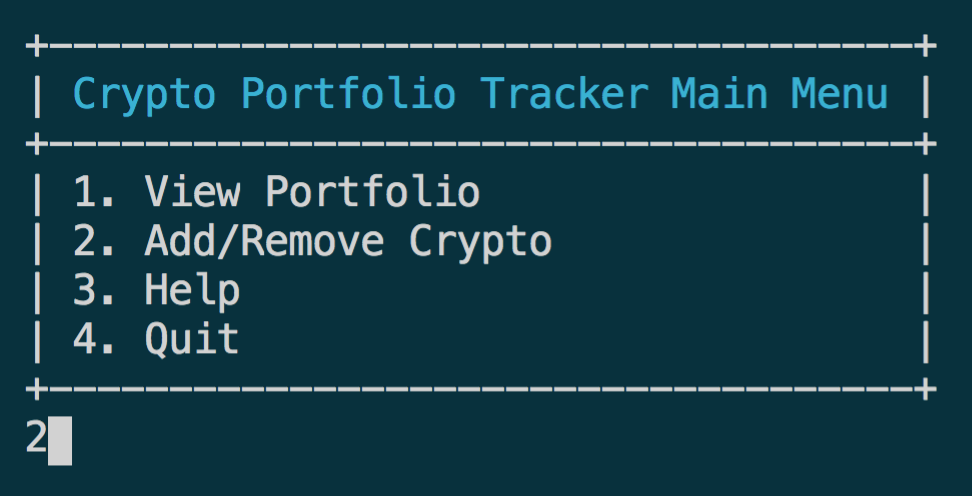
<div style="clear: both;"></div>

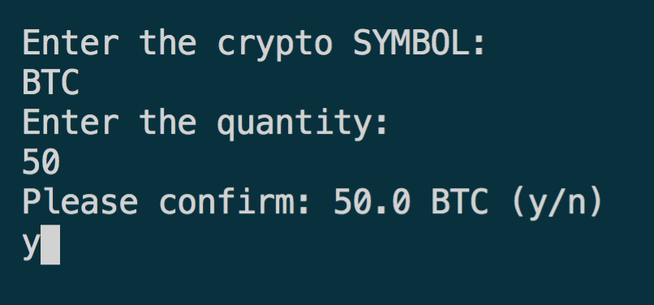
<div style="clear: both;"></div>

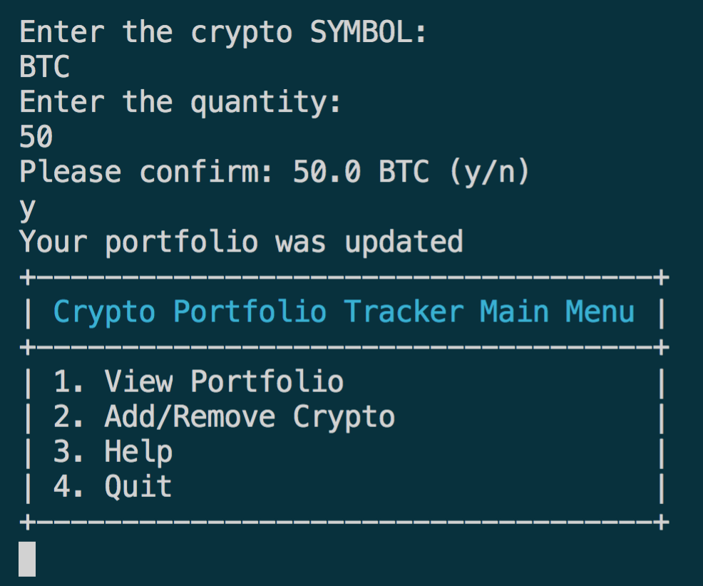
<div style="clear: both;"></div>

Below is the output of the portfolio view after adding the 50 Bitcoin:

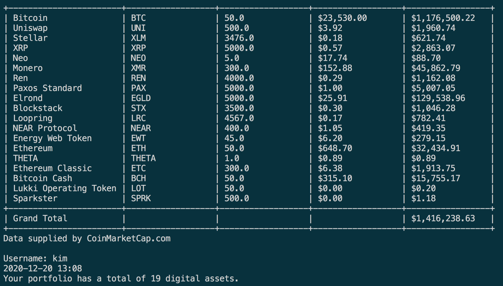
<div style="clear: both;"></div>

Here is a second test showing the addition of 1000 Chainlink (LINK):

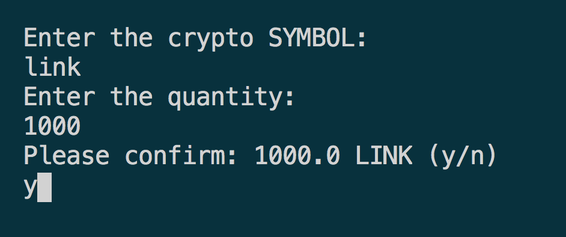
<div style="clear: both;"></div>

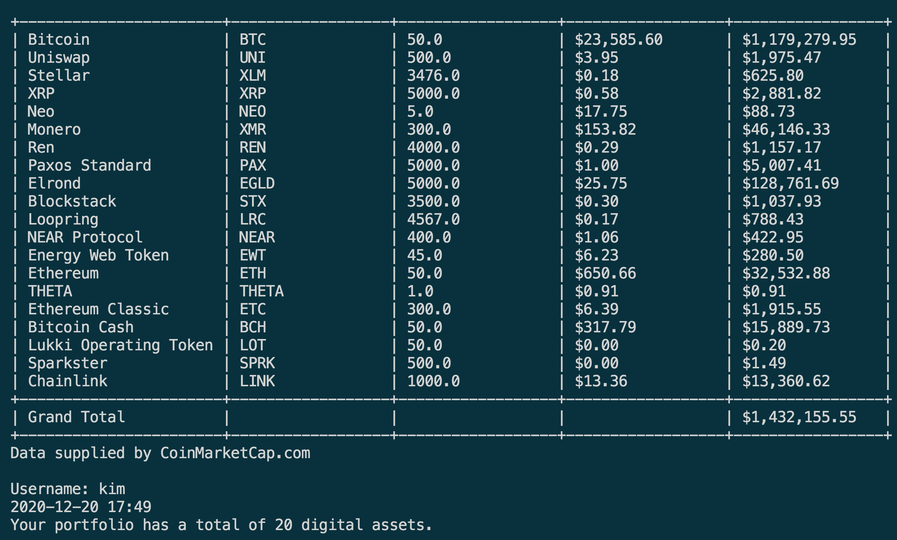
<div style="clear: both;"></div>

As part of the testing process for adding or modifying cryptos, two cases were considered:
1. Incorrect symbol  
A symbol that is not defined does not cause an error, it is simply not added because it runs a match on the existing array of symbols first.

2. Negative quantity
This was handled by some simple logic that checked for greater than or equal to zero on the user input. An error is handled with "You cannot enter a negative number for quantity. Must be positive or zero" and flow breaks out of the add_crypto_to_portfolio method back to the menu handler.

Additonally there was the case when a crpto was added with a zero quantity. In this instance, it serves as a method of 'deleting' the asset from the portfolio. All 0 quantity hashes are excluded from the portfolio view build.


