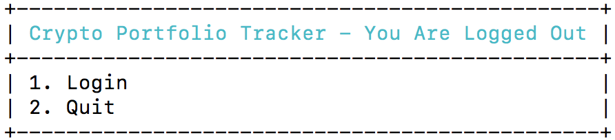
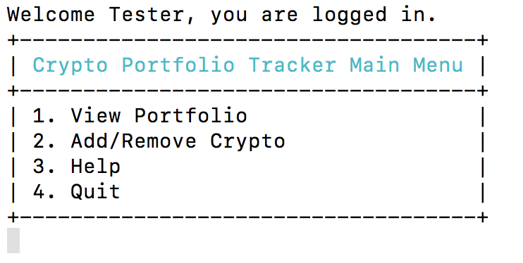
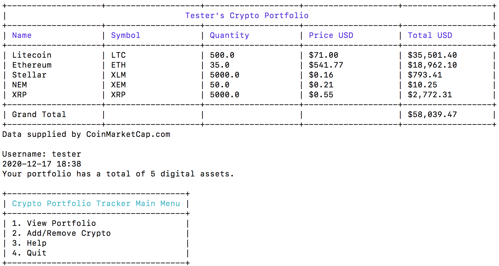
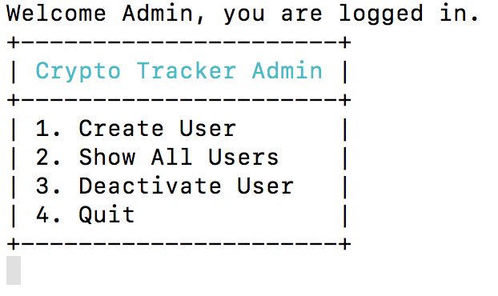
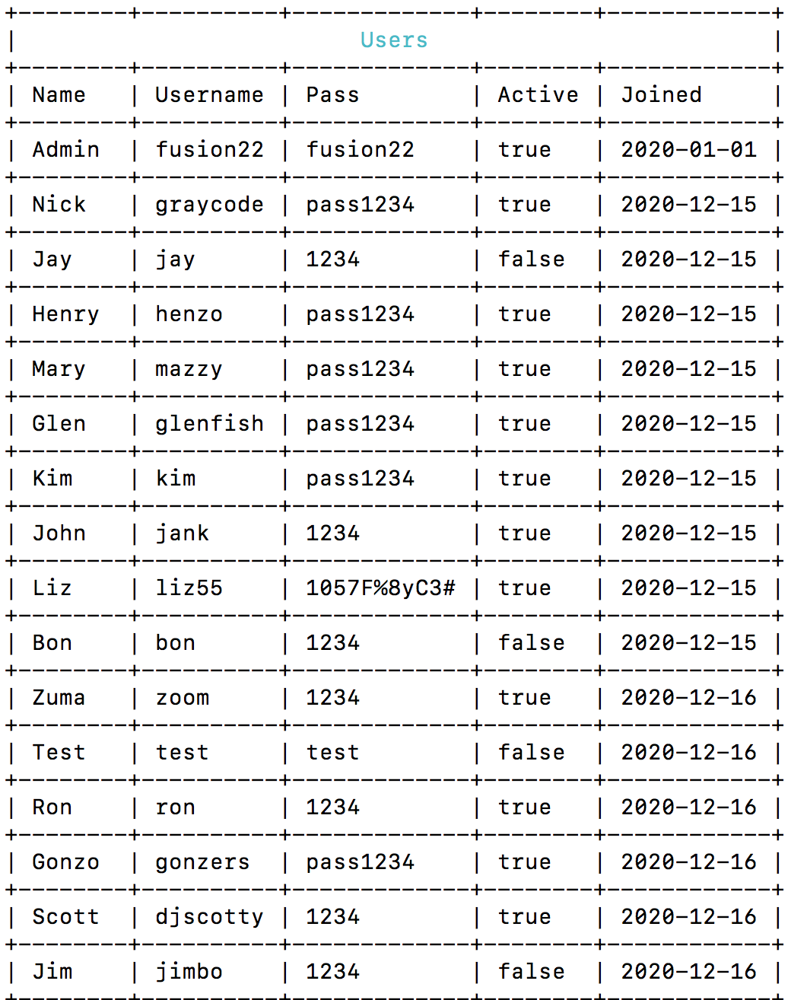

# CryptoTracker

CryptoTracker v 1.0  
Built with Ruby 2.7.2

## Application Overview

A terminal application for creating and managing a portfolio of cryptocurrency or digital assets using live market rate API data.

CORE features:

- command line application
- text driven menu
- connect/input live API digital asset data (requires API entry by user for security)
- connect/input static local JSON data for testing
- create user (Admin only)
- login user (using username only)
- set to live data or test file data
- add to portfolio (buy digital assets)
  - asset_symbol
  - asset_quantity
- delete portfolio (delete purchases or delete entire portfolio)
- show current portfolio
- Classes for Users and Portfolios
- JSON file read/write methods for Users and Portfolios
- log out

Additonal planned features post MVP:

- add and display 24hr % change, market cap, asset_buy_date, asset_sell_date, usd_profit, btc_profit
- edit all aspects of portfolio
- display summary profit and loss statement
- save portfolio view or P&L to PDF or print
- user account creation, password usage and authentication on user accounts

## Testing

rspec  
< testing data and screenshots here >

## API

The API is using CoinMarketCap.com. 

To test, the JSON output for the first 100 cryptos on Coin Market Cap will be saved to a text file and accessed locally. 

Account with CoinMarketCap using the following credentials:  

url: https://pro-api.coinmarketcap.com/v1/cryptocurrency/quotes/latest?symbol=BTC  
account url: https://pro.coinmarketcap.com/account  
data limits: 333 per day. 10k per month

The following symbols will be used for this test file:  
`
BTC,ETH,XRP,USDT,BCH,LTC,LINK,ADA,DOT,BNB,XLM,USDC,BSV,EOS,XMR,WBTC,TRX,XEM,XTZ,LEO,FIL,CRO,NEO,DAI,VET,REV,ATOM,AAVE,DASH,WAVES,HT,MIOTA,UNI,ZEC,ETC,YFI,THETA,BUSD,COMP,CEL,MKR,SNX,OMG,DOGE,UMA,KSM,FTT,ONT,ZIL,ALGO,SUSHI,OKB,BTT,BAT,TUSD,RENBTC,DCR,NEXO,ZRX,DGB,PAX,HUSD,AVAX,REN,QTUM,HBAR,AMPL,ICX,ABBC,CELO,LRC,EGLD,HEDG,STX,LUNA,KNC,RSR,REP,EWT,LSK,OCEAN,BTG,SC,QNT,RUNE,CVT,NANO,BAND,MANA,ZB,NMR,ENJ,ANT,MAID,SNT,CHSB,XVG,NXM,RVN
`

## Github Repository

[Crypto Portfolio Tracker App on Github](https://github.com/glenfish/Crypto-Portfolio-Tracker)

## Trello Board - Project Management

[Crypto Portfolio Tracker App Trello Board](https://trello.com/b/9gKJL3WM/crypto-portfolio-manager-terminal-app)

## Data Persistence

User and user's portfolio data is stored locally in JSON file format. A User class instantiates the current user at login and facilitates attribute passing for personalisation of the user experience as well as writing and reading to the correct portfolio file.

Upon user creation, a user is created as an object of the User class, and a portfolio is created as an object of the Portfolio class. The latter uses a method to build the user's portfolio file in JSON format, which is written locally for storage.

At this stage the Portfolio class is only used in this instance, however it will be incorporated more fully with the addition of more app features.

## Error Handling

- tba

## Installation

Ruby 2.7.2 required to run CryptoTracker  
The following gems are packaged:  
httparty  
json  
terminal-table  
colorize version 0.8.1 or greater  

## Usage

CryptoTracker is designed for people who buy and sell digital assets or 'cryptocurrency'. A user can create a portfolio of cryptos from the top 100 assets listed on CoinMarketCap.com and get real time price data to track the portfolio value.

The user can add a symbol name that represents the cryptocurrency on trading exchanges, and the quantity purchased. The app will display a list of all entries, showing name, symbol, quantity, current USD price of the asset, and the current USD value of the user's assets, with a grand total showing the combined portfolio value.

In addition to real time pricing data, there is a menu option to display recent API data which is stored locally. This is primarily for testing, but can be useful when adding new cryptos to the portfolio, and the user simply wants to check the list without requesting fresh live data with every refresh of the portfolio page.

An administrator account has user creation privilliges and can deactivate any given user. Admin can also view the full list of users, usernames, passwords, status and date the user was created.

All users are stored together locally in 'users' JSON file, and each puser has their own porfolio JSON file based on their username. The file contains data on the cryptocurrency symbols (for example 'BTC' for Bitcoin, or 'ETH' for Ethereum) and quantities of cryptos being tracked in the portfolio for each given user.

 
 
 
 
 
 

